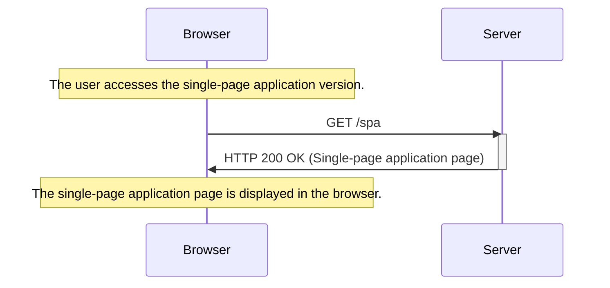

```mermaid
sequenceDiagram
    participant Browser
    participant Server
    Note over Browser: The user accesses the single-page application version.
    Browser->>Server: GET /spa
    activate Server
    Server->>Browser: HTTP 200 OK (Single-page application page)
    deactivate Server
    Note over Browser: The single-page application page is displayed in the browser.
    
```
