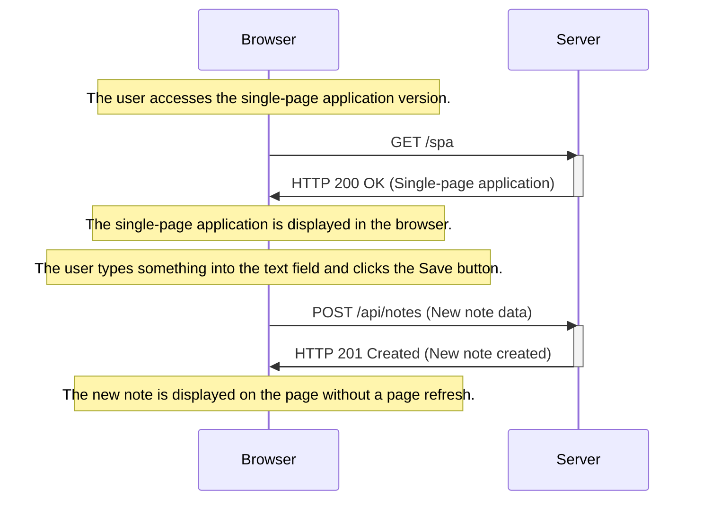

```mermaid
sequenceDiagram
    participant Browser
    participant Server
    Note over Browser: The user accesses the single-page application version.
    Browser->>Server: GET /spa
    activate Server
    Server->>Browser: HTTP 200 OK (Single-page application)
    deactivate Server
    Note over Browser: The single-page application is displayed in the browser.
    Note over Browser: The user types something into the text field and clicks the Save button.
    Browser->>Server: POST /api/notes (New note data)
    activate Server
    Server->>Browser: HTTP 201 Created (New note created)
    deactivate Server
    Note over Browser: The new note is displayed on the page without a page refresh.
```